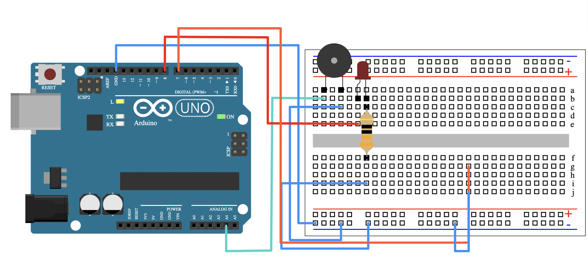
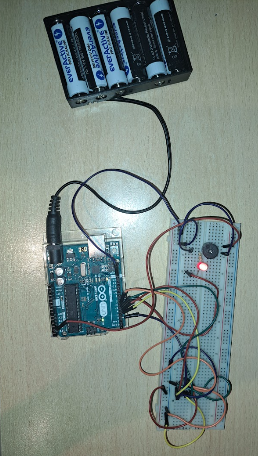

# Arduino barka bomb
Cut one wire to play [Barka song](https://en.wikipedia.org/wiki/Lord,_You_Have_Come_to_the_Lakeshore) as a reward!

## General info
This project has been written as a part outdoor game. The purpose is to connect many jumper wires which vary in colour, prepare the defusal manual and play a song when the correct wire is cut off.

## Hardware
* Arduino Uno
* Passive buzzer ([Buzzer without generator 5V 1mm - THT](https://botland.store/buzzers-sound-generators/18290-buzzer-without-generator-5v-1mm-tht-5904422366025.html))

## Credits
* https://github.com/robsoncouto/arduino-songs - general structure of playing song function
* https://prostenuty.pl/barka-proste-nuty - music notation
* https://simulation.iitbx.in/arduino - arduino circuit design tool

## License
You can check out the full license [here](./LICENSE)

This project is licensed under the terms of **the MIT license**.